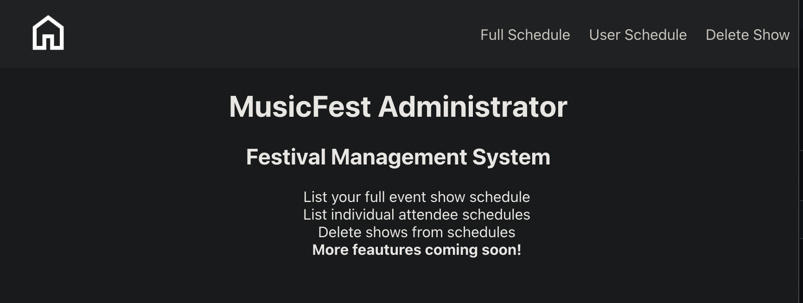
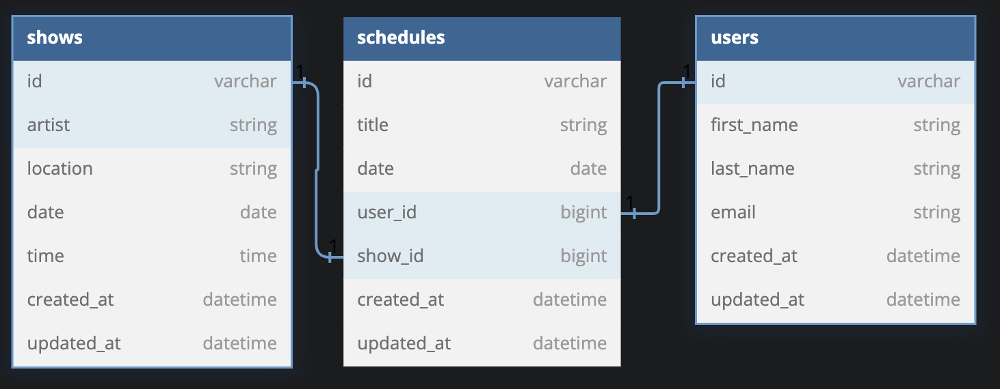

# MusicFest Administrator (Back End)

## Preview


MusicFest Administrator is a tool to help people running music festivals.  It allows you to get a full list/schedule of all performing acts, a schedule for a specific attendee, and to delete artists from specific schedule slots.

This is the backend portion of the application that contains the database for user accounts, shows/acts performing, and schedules that are used inside the front end application.  The MusicFest Administrator Front End can be found [here](https://github.com/MiTOBrien/musicfest_administrator).

### Deployed Site
- Coming soon

## Getting Started
Clone down the resposity to your location machine, cd into the direcotry and run: 
- bundle install
- rails db:{drop,create,migrate,seed} or rails db:reset

At this point you can run the backend and run the test suite or test backend functionality by launching the server from the command line:
- rails s or rails server

To see the app fully functioning you will also need to clone down the front end and run that as well.

## Technology Used

- Ruby v3.2
- Rails v7.1
- PostgreSQL
- JSONAPI-Serializer
- rack-cors

*These are included as gems and installed when bundle install is run from the command prompt.


## Database Creation/Initialization



From the command prompt run:
- rails db:{drop,create,migrate,seed} or rails db:reset

## Sample Requests/Responses

### GET /api/v1/schedules/"user_id"
```json
{
    "user_name": "Bill Peters",
    "schedules": [
        {
            "title": "Carrie Live",
            "date": "2025-02-01",
            "id": null
        },
        {
            "title": "Just Off The Voice",
            "date": "2025-02-02",
            "id": null
        }
    ]
}
```
### GET api/v1/schedules
```json
[
    {
        "title": "End of an Era",
        "date": "2025-01-31"
    },
    {
        "title": "Litte Boo Show",
        "date": "2025-01-31"
    },
    {
        "title": "Carrie Live",
        "date": "2025-02-01"
    },
    {
        "title": "Dirty Blonde",
        "date": "2025-02-01"
    },
    {
        "title": "Twisted Rock",
        "date": "2025-02-01"
    },
    {
        "title": "Just Off The Voice",
        "date": "2025-02-02"
    }
]

## Test Suite
- RSpec
- Factory Bot
- Faker
- Shoulda-Matchers
- SimpleCov

To run the RSpec tests from the command prompt run: 
- bundle exec rspec spec

## Contributors
- Michael O'Brien [github](https://github.com/MiTOBrien) [LinkedIn](https://www.